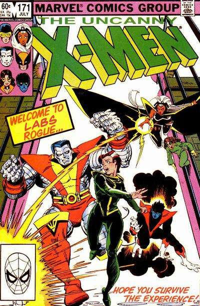

# Welcome to Sunlight & Sunlight Labs!

_If somebody offers you an amazing opportunity but you are not sure you can do it, say yes – then learn how to do it later!_ 

\- Richard Branson

Welcome again to Sunlight Labs! there are some things you'll probably want to know when you start working at Sunlight. This document will hopefully give you a head start.

## The Labs Team

You can find all Sunlight staff, advisers, and contractors on the main [Sunlight Team Page](http://sunlightfoundation.com/team/).

## Slack

We primarily use [Slack](https://sunlight.slack.com/) for office and team communications. There are channels for [#labs](https://sunlight.slack.com/messages/labs/), [#design](https://sunlight.slack.com/messages/design/), [#general](https://sunlight.slack.com/messages/general/), etc. We also have a private channel [#labs-private](https://sunlight.slack.com/messages/labs-private/) for labs. Request an invite if we don't invite you first!

## Trello

We primarily use [Trello](https://trello.com/) for project management. Check out our boards [here](https://trello.com/sunlightlabs). Perhaps the most important board is the [Lab's Meta Board](https://trello.com/b/kzsvElaz/labs). It's critical you have access to these boards so ask Kat or Clayton if you can't access them.

## Email & Calendar

We currently use Google Apps for email and calendar (and Google Docs/Drive). Your username is your first initial and last name at sunlightfoundation.com. (For example: jdoe@sunlightfoundation.com). You can login through the normal gmail interface by using your full email address as your username. If you are having trouble logging into your email account or don't think you have one set up, find Clayton.

Please also check out [Sunlight's Google Apps](http://www.google.com/a/sunlightfoundation.com) which include Google Docs and Google Calendar.

### Internal Mailing Lists

Email lists were much more important in the early years of Sunlight (circa late 2000's to early 2010's). We primarily use [Slack](https://sunlight.slack.com/) for communication now. However, for longer correspondences we still use email.

Consider signing up for these mailing lists:

* [All Staff](mailto:allstaff@sunlightfoundation.com) - You don't want to miss this one - Double check with Scott that you are signed up if you don't get all staff email after a day or two.
* [All Labs](mailto:alllabs@sunlightfoundation.com) - Another not-to-be-missed list.

There are also ad-hoc email lists for other things as well, but may have faded into disuse over the years as we moved to Slack.

### Shared Calendars

You may want to ensure that you have access some of our shared calendars. Access is handled by Operations.

Consider joining
* Sunlight Foundation

As well as all of the room calendars
* Conference Room
* Breakout South
* Breakout North
* Booth South
* Booth North
* Work Room

## Twitter

People here use twitter. You can find a [full list of Sunlight staff that use twitter](https://twitter.com/#!/SunFoundation/sunlighters).

## Staff Page on Sunlightfoundation.com

[http://sunlightfoundation.com/staff](http://sunlightfoundation.com/staff) is a helpful page where you can find quick access to:

* Sitewide statistics
* Your profile including title, bio, social media presence, image, blogposts and contact information.
* A staff contact directory that you can and should keep up to date
* Wordpress access
* A link to our [blog style guide](https://sunlightfoundation.com/blog/styleguide/)
* A shortcut to the Appear.in "hangout".
* Shortcut to Rex, our custom kitchen duty app
* Access to the sunlightfoundation.com admin

## Google Groups

We have a **sunlightlabs** Google Group, "An open list for software developers interested in open government, government transparency, and civic hacking." We also have a **Sunlight Labs API Discussion** group. People ask us questions about our APIs there.

## Dropbox

We have a **Labs** shared folder that gets some use, a **Design** shared folder which is huge and gets a lot of use, and a **sunlight-operations** folder (that is for all of Sunlight). Contact Clayton, Andy, or Albert for access.

## Developer tools

Use what you want! A number of people like [Sublime Text](http://www.sublimetext.com/), some use Vim or Emacs. [Atom](https://atom.io/) calls itself "the future," so there's that. If there is something you want that is *costs money* (a reasonable amount), we may be able to buy it for you.

## Version Control

We use [Git](http://git-scm.com) for source code management and pushes to production. You should become proficient in Git if you're not already. Please visit our [Sunlight Labs GitHub account](https://github.com/sunlightlabs) for public and some private (likely soon-to-be-public) projects.

## Supplies

Supplies are in the supply room. It is primarily a free-for-all in there. Have at it if you need pens, paper, etc. If you can't find what you are looking for, contact Alex. Also, please feel free to take initiative and clean out junk if you think it is piling up.

## Overall Team Atmosphere

We're a team, so if one person's got a problem, it is everybody's problem. // TODO
